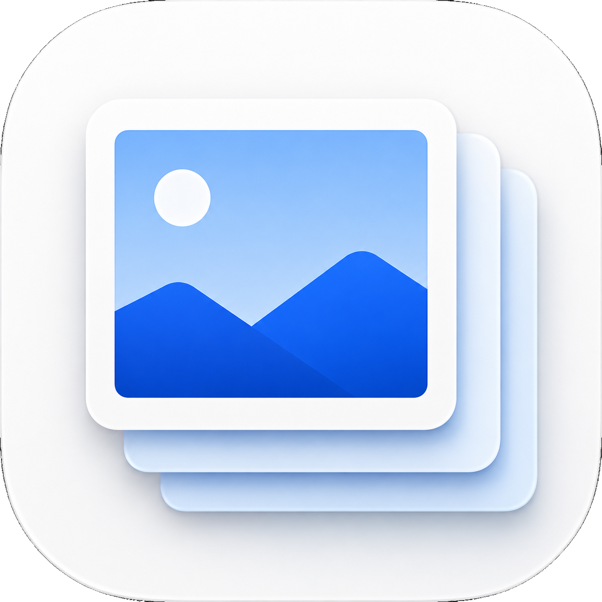
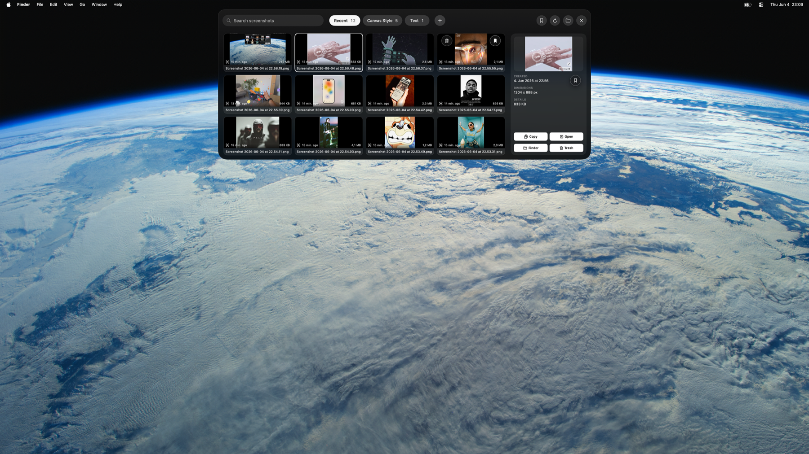

<h1 align="center">
  
  Screenshoss
</h1>

<p align="center">
  A free macOS screenshot shelf that keeps your Desktop clean.
</p>



Screenshoss is a free macOS screenshot shelf. It watches for Mac screenshots, moves them out of the Desktop, and keeps them in a fast hover panel at the top of the screen.

The app is currently named **Shoss** in the macOS bundle.

## What It Does

- Collects new macOS screenshots automatically.
- Keeps your Desktop clean by moving screenshots into the Shoss screenshots folder.
- Opens from a small notch-style shelf at the top of the screen.
- Shows recent screenshots in a compact grid.
- Supports folders, drag-and-drop organization, rename, delete, favorite, copy, Finder reveal, and Preview open.
- Includes a favorites view for screenshots you want to keep close.
- Runs locally. No account, cloud sync, analytics, or network service is required.
- Ships as a universal macOS app for Apple Silicon and Intel Macs.

## Download

Download the latest packaged app from [`dist/Shoss.dmg`](dist/Shoss.dmg).

You can also download [`dist/Shoss.app.zip`](dist/Shoss.app.zip) if you prefer the zipped app bundle.

## Install

1. Download `Shoss.dmg`.
2. Open the DMG.
3. Drag `Shoss.app` into `Applications`.
4. Open Shoss.

This early build is ad-hoc signed and not notarized yet, so macOS may show an extra confirmation the first time you open it. If that happens, right-click the app and choose **Open**.

## How It Works

When you take a screenshot with macOS, Shoss imports supported screenshot image files from your Desktop into:

```text
~/Library/Application Support/Shoss/Screenshots
```

On first launch, Shoss does not create any custom folders. The shelf starts with **Recent** and the `+` button.

When you create a folder in the app, it maps directly to a subfolder inside the Shoss screenshots location:

```text
~/Library/Application Support/Shoss/Screenshots/<Your Folder Name>
```

The **Recent** pill shows screenshots that are still in the main Screenshots folder. When you drag a screenshot into a custom folder, it leaves Recent and appears in that folder.

## Using The Shelf

- Hover the notch at the top of the screen to open the screenshot shelf.
- Click a screenshot to select it and see details on the right.
- Double-click a screenshot to open it in Preview.
- Press Space while a screenshot is selected to open macOS Quick Look.
- Drag screenshots onto folder pills to organize them.
- Click `X` to hide the shelf. This does not quit Shoss.
- Use the status bar camera icon to show Shoss again.
- Right-click the status bar icon to open the menu with **Open Shoss**, **Open Screenshots Folder**, and **Quit Shoss**.

## Edit Or Build From Source

If you want to inspect or edit the app:

1. Click **Code** on GitHub.
2. Choose **Download ZIP**.
3. Unzip the project.
4. Open the folder in Xcode or your editor.

Requirements:

- macOS 13 or later
- Xcode with Swift 6.3 support

Run tests:

```bash
swift test
```

Build a fresh universal app, DMG, and app zip:

```bash
scripts/package_dmg.sh
```

The release files will be written to `dist/`.

## Privacy

Screenshoss is local-first. Screenshot files stay on your Mac unless you manually share them. The app does not require a login or upload your screenshots.

## License

MIT. Free to use, modify, and share.
