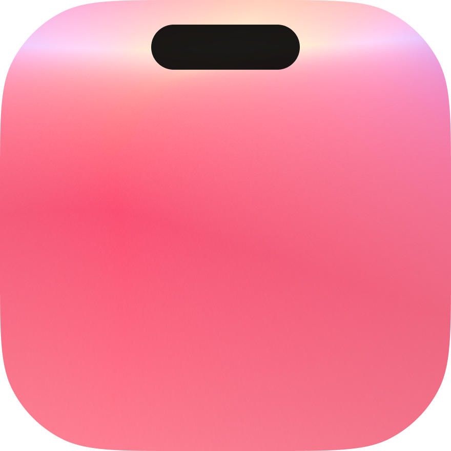
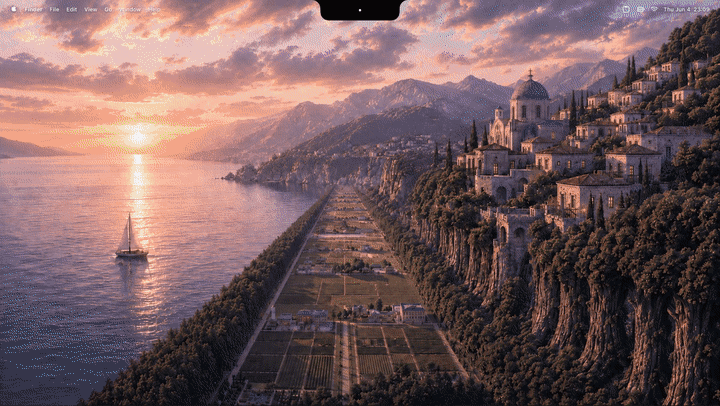
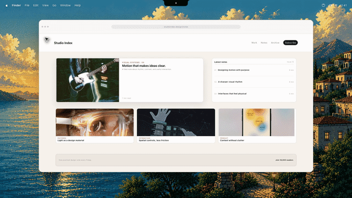
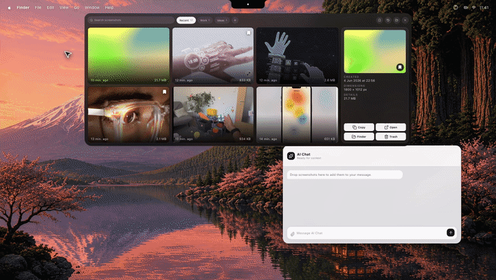
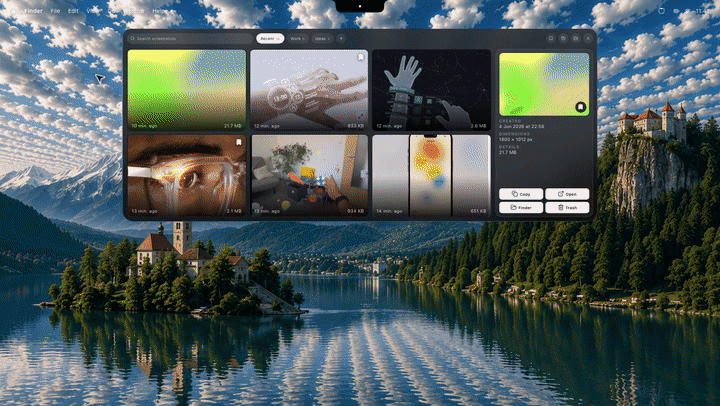

<h1 align="center">
  
  Screenshoss
</h1>

<p align="center">
  <strong>Off your Desktop. One hover away.</strong>
</p>

<p align="center">
  A completely free, open-source screenshot shelf for macOS.
</p>

<p align="center">
  <a href="https://screenshoss.com/"><strong>Website</strong></a>
  ·
  <a href="dist/Screenshoss.dmg"><strong>Download for Mac</strong></a>
  ·
  <a href="https://buymeacoffee.com/uxself"><strong>Buy me a beer</strong></a>
</p>

<p align="center">
  macOS 13+ · Apple Silicon + Intel · No account · No cloud · No analytics
</p>

<p align="center">
  
</p>

Screenshoss catches each new Mac screenshot, moves it away from your Desktop, and keeps it in a fast shelf at the edge of your screen. Your screenshots stay on your Mac.

## See it in action

### Captured automatically

Take a screenshot as usual. Screenshoss detects the new capture and moves it into the **Recent** shelf. You do not have to clean your Desktop or import a file.



### Folders, favorites, and fast selection

Create real folders, keep important captures close, select multiple screenshots, and drag the selection directly into another app.



### Top, left, or right

Put the shelf where it fits your work. Use the status bar menu to move it to the top, left, or right edge. Screenshoss remembers your selection.



## What it does

- Collects new macOS screenshots automatically.
- Moves screenshots from the Desktop into the Screenshoss screenshots folder.
- Opens from a small shelf at the top, left, or right edge of the screen.
- Shows recent screenshots in a compact grid.
- Supports folders, favorites, rename, delete, copy, Finder reveal, and Preview open.
- Supports multi-selection with Shift-click and Command-click.
- Lets you drag selected screenshots into folders or other applications.
- Runs locally without an account, cloud sync, analytics, or a network service.
- Runs on Apple Silicon and Intel Macs.

## Download

Download the current universal installer:

- [`Screenshoss.dmg`](dist/Screenshoss.dmg) — recommended installer
- [`Screenshoss.app.zip`](dist/Screenshoss.app.zip) — zipped application bundle

The packaged release is signed with a Developer ID certificate and notarized by Apple.

## Install

1. Download `Screenshoss.dmg`.
2. Open the DMG.
3. Drag `Screenshoss.app` onto the **Applications** shortcut.
4. Open Screenshoss.

## How it works

Screenshoss imports supported screenshot image files from your Desktop into:

```text
~/Library/Application Support/Screenshoss/Screenshots
```

On first launch, the shelf contains **Recent** and the `+` button. Screenshoss does not create custom folders until you ask it to.

Each folder that you create in the app maps to a subfolder:

```text
~/Library/Application Support/Screenshoss/Screenshots/<Your Folder Name>
```

The **Recent** pill shows screenshots that are still in the main Screenshots folder. When you drag a screenshot into a custom folder, it leaves Recent and appears in that folder.

## Use the shelf

- Hover over the notch to open the shelf.
- Click a screenshot to select it and see its details.
- Double-click a screenshot to open it in Preview.
- Press Space to open Quick Look for the selected screenshot.
- Shift-click to select a range of screenshots.
- Command-click to add or remove screenshots from the selection.
- Press Command-C to copy the selection.
- Press Delete or Backspace to delete the selection.
- Drag screenshots onto folder pills to organize them.
- Drag one selected screenshot to move the full selection.
- Click `X` to hide the shelf without quitting Screenshoss.
- Use the status bar icon to show Screenshoss again.
- Right-click the status bar icon to open **Open Screenshoss**, **Notch Position**, **Open Screenshots Folder**, and **Quit Screenshoss**.
- Use **Notch Position** to select **Top Notch**, **Left Notch**, or **Right Notch**.

When Screenshoss is installed in `Applications`, it uses the native macOS login-item service to start after you sign in.

## Build from source

Requirements:

- macOS 13 or later
- Xcode with Swift 6.3 support

Run the tests:

```bash
swift test
```

Build a universal application, DMG, and application zip:

```bash
scripts/package_dmg.sh
```

The release files are written to `dist/`.

## Privacy

Screenshoss is local-first. Screenshot files stay on your Mac unless you share them. The app does not require a login and does not upload your screenshots.

## License

Screenshoss uses the [MIT License](LICENSE). You can use, modify, and share it.
